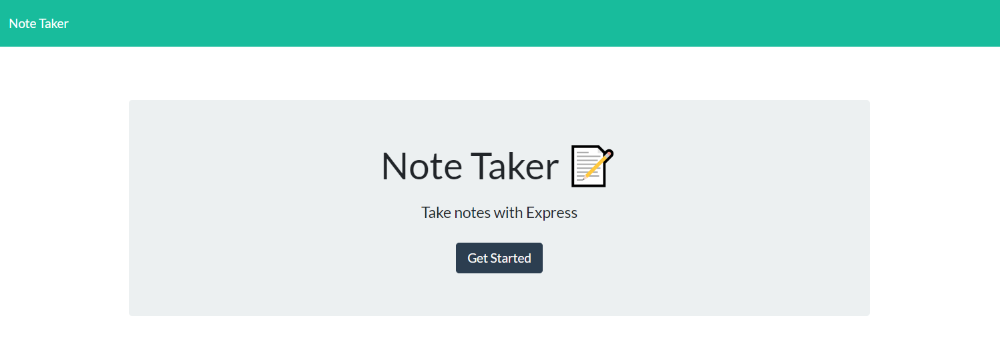
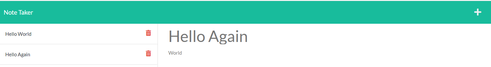

# Note-Taker


[Check Out the Note Taker App on Heroku Here](https://warm-mesa-29232.herokuapp.com/)

## Table of Contents

*[Description](#description)

*[Prerequisites](#prerequisites)

*[Installation](#installation)

*[Usage](#usage)

*[License](#license)

## Description

This is an application that can be used to write, save, and delete notes. This application will uses express backend and save and retrieve note data from a JSON file.

This application should meet the following criteria:

```
GIVEN a note-taking application
WHEN I open the Note Taker
THEN I am presented with a landing page with a link to a notes page
WHEN I click on the link to the notes page
THEN I am presented with a page with existing notes listed in the left-hand column, plus empty fields to enter a new note title and the note’s text in the right-hand column
WHEN I enter a new note title and the note’s text
THEN a Save icon appears in the navigation at the top of the page
WHEN I click on the Save icon
THEN the new note I have entered is saved and appears in the left-hand column with the other existing notes
WHEN I click on an existing note in the list in the left-hand column
THEN that note appears in the right-hand column
WHEN I click on the Write icon in the navigation at the top of the page
THEN I am presented with empty fields to enter a new note title and the note’s text in the right-hand column
```

## Prerequisites
* [NodeJS](https://nodejs.org/)

## Installation

Clone the repository to your local development environment.

Navigate to your repository folder in the terminal and run `npm install` to install all dependencies.

## Usage

[Click the Link to Open the App on Heroku](https://warm-mesa-29232.herokuapp.com/)





*Click on the Get Started button.*
*Enter in a new note and description, and hit the save button in the top right corner*
*You can delete the notes by click the trash icon next to the saved notes on the list*
*You can review the notes by clicking the notes you'd like to display from the list of notes*


## License

This project is licensed under the ISC License.


